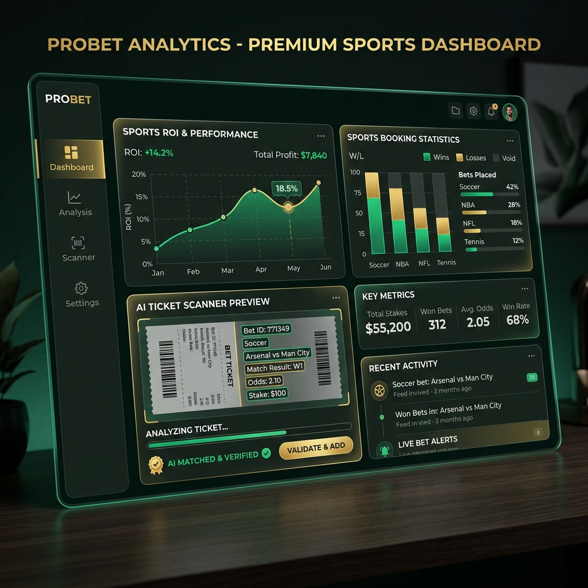
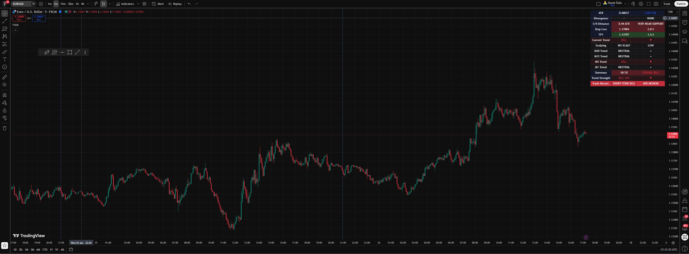
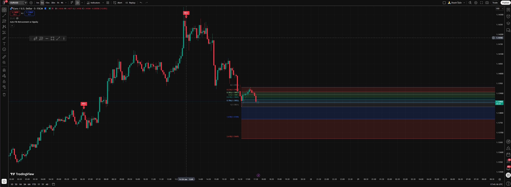
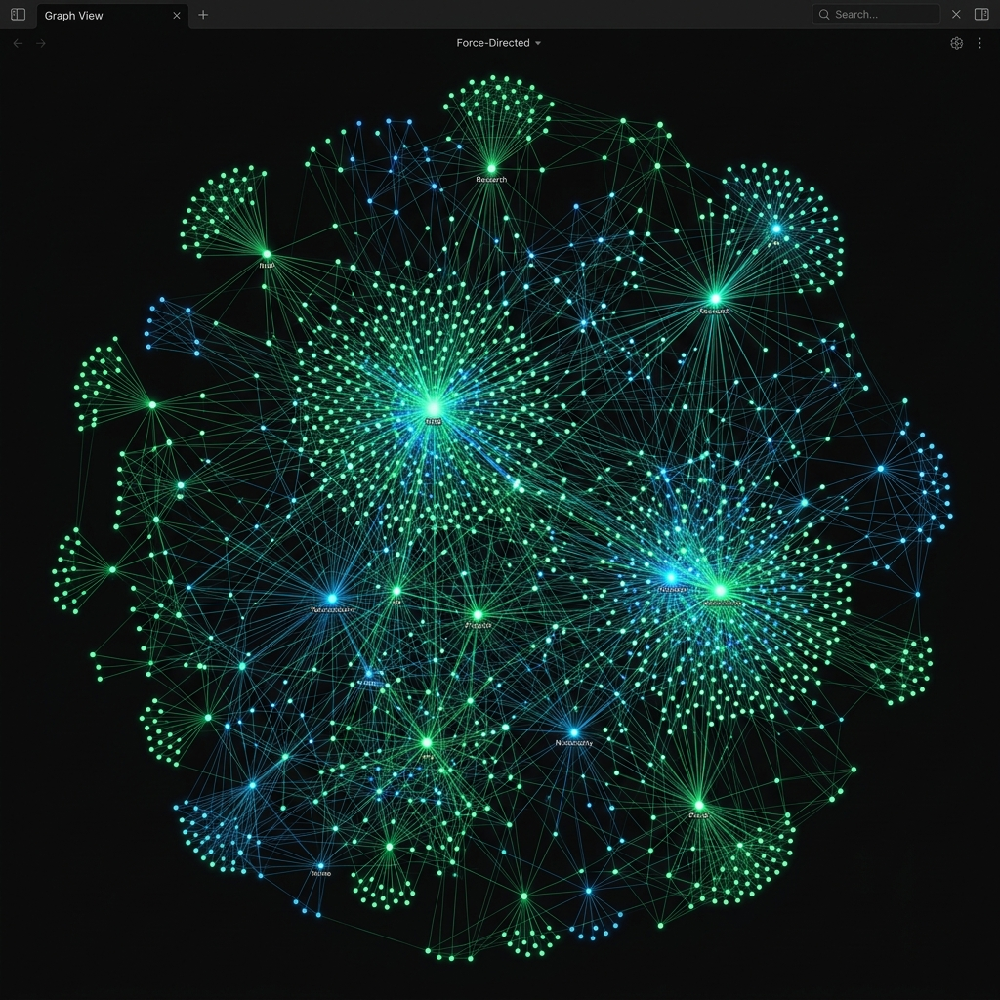
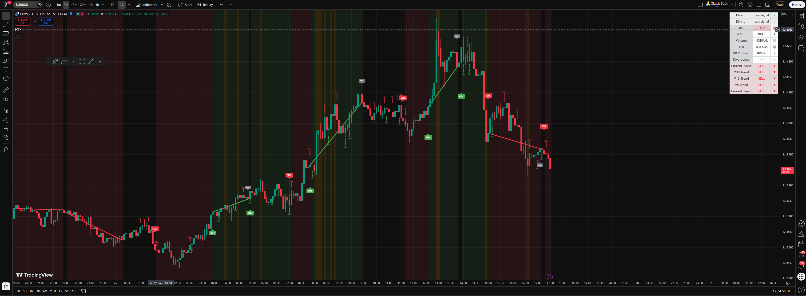
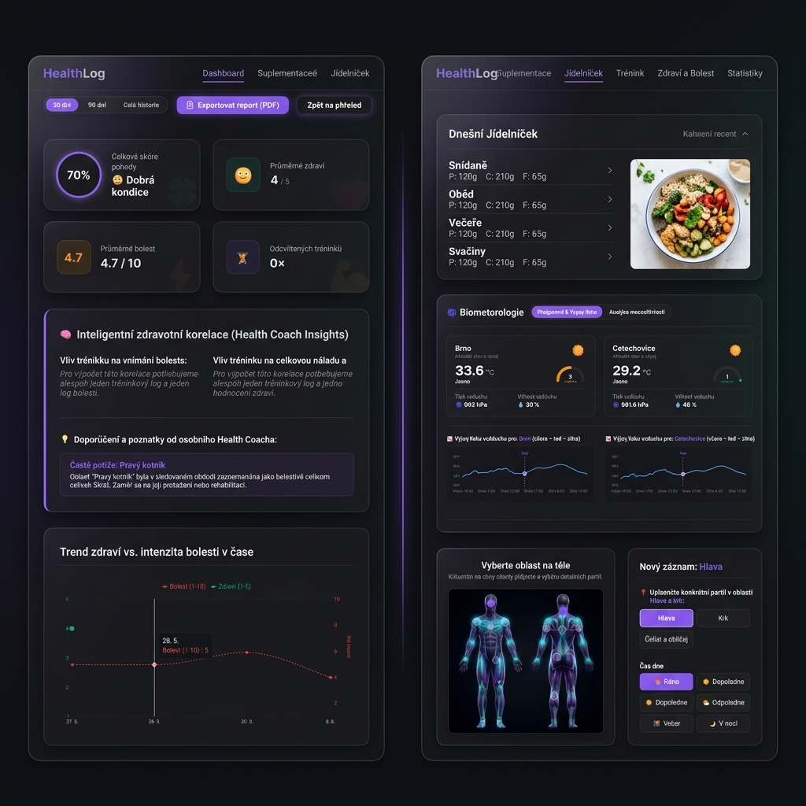
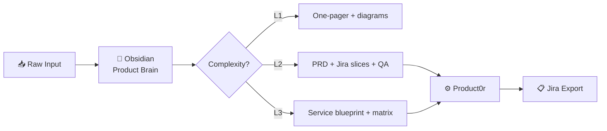

 

  

---

## About

**Panzmoravy Lab** is where I ship experiments and production-grade tools at the intersection of **product leadership**, **fintech**, and **applied AI**.

I'm a product leader who bridges business vision and technical execution — from strategy and roadmap (PM / Head of Product) to backlog prioritization and hands-on delivery (PO). I build **end-to-end systems** for fintech, betting, and trading: open-source TradingView indicators, algo trading bots with local LLMs, betting analytics with OCR import, n8n integrations (Jira → Slack / Sheets), and full-stack web apps.

What ties it together: **modular architecture**, **auditable decision logic**, and **practical AI** — gates, scoring, and human-in-the-loop review.

> *Product Leader · Fintech & Trading · Workflow Automation · Full-stack · AI Operations*

---

## Impact at a glance

  
  
  
  
  
  

---

## Featured work

 

**[`Bet_Tracker`](https://github.com/panzmoravylab/Bet_Tracker)**  
 

 

Sports betting tracker — AI OCR ticket import, ROI analytics, Chrome extension

 

 

 

**[`Table Logic Extractor`](https://www.tradingview.com/script/f0wHmYE5-Table-Logic-Extractor/)**  
 

 

14 metrics in one table — MTF, confidence score, SL/TP

 

 

 

**[`Fibonacci Pro`](https://github.com/panzmoravylab/Fibonacci_Pro)**  
 

 

Auto Fibonacci retracement with signals for TradingView

 

 

 

**[`Product0r`](https://github.com/panzmoravylab/Product0r)**  

 

User Story Mapping → LM Studio → Jira Wiki Markup + PDF

 

 

<b>More projects</b>

 

  
  &nbsp;&nbsp;
  

 

**Trading / Algo**  

 

**Full-stack Apps**  

 

**Automation**  

 

**Data Pipeline**  

---

## How I work

**Loop:** Raw input → Ingest & context → Feature Factory (L1–L3) → Product0r → Jira stories

I don't start with code. I map systems into a connected knowledge vault, then run versioned AI prompts on top — turning messy input into PRDs, Mermaid diagrams, and precisely sliced user stories.

---

## Tech stack

  
  
  
  
  
  
  
  
  
  
  
  
  
  

---

## GitHub activity

&nbsp;

  

  

<picture>
  <source media="(prefers-color-scheme: dark)" srcset="https://raw.githubusercontent.com/panzmoravylab/panzmoravylab/output/github-contribution-grid-snake-dark.svg">
  <source media="(prefers-color-scheme: light)" srcset="https://raw.githubusercontent.com/panzmoravylab/panzmoravylab/output/github-contribution-grid-snake.svg">
  
</picture>

---

## Let's connect

 

🟢 **Open to collaboration and opportunities**

*Happy to demo Bet_Tracker live (OCR + dashboard), walk through n8n workflows, TradingView indicators, or algo system logs.*

---

  

