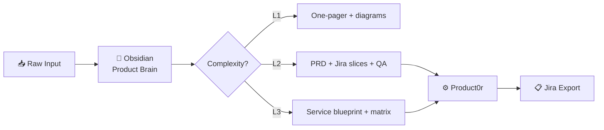

<!-- Header banner -->

 

  

<!-- Typing animation -->

---

## About

**Produktový lídr**, který spojuje byznysovou vizi s technickou exekucí — od strategie a roadmapy (PM / Head of Product) přes prioritizaci backlogu (PO) až po **hands-on delivery** v produkčním kódu.

Stavím **end-to-end systémy** pro fintech, betting a trading: open-source indikátory na TradingView, automatizované obchodní boty s lokální AI, betting analytiku s OCR importem, n8n integrace (Jira → Slack / Sheets) a full-stack webové aplikace. Spojuje mě **modulární architektura**, **auditovatelná rozhodovací logika** a **praktická AI** (gate, scoring, human-in-the-loop).

> *Product Leader · Product Manager · Fintech & Trading · Workflow Automation · Full-stack Dev · AI Operations*

---

## Impact at a glance

<table align="center">
  <tr>
    <td align="center" width="160">
       
      <strong>900+</strong> 
      TradingView chart uses
    </td>
    <td align="center" width="160">
       
      <strong>731</strong> 
      Table Logic Extractor users
    </td>
    <td align="center" width="160">
       
      <strong>7+</strong> 
      AOS / algo systems
    </td>
    <td align="center" width="160">
       
      <strong>16 ★</strong> 
      Fibonacci Pro
    </td>
    <td align="center" width="160">
       
      <strong>3</strong> 
      Full-stack products
    </td>
    <td align="center" width="160">
       
      <strong>2</strong> 
      Public n8n templates
    </td>
  </tr>
</table>

---

## What I bring

<table>
<tr>
<td width="50%" valign="top">

### 🎯 Product & Delivery
- Celý produktový lifecycle — discovery → backlog → release
- ICE / RICE prioritizace, metriky úspěchu, ROI-driven rozhodování
- Cross-functional týmy (15+ lidí), incident management
- Obsidian Product Brain + **Product0r** → Jira export

</td>
<td width="50%" valign="top">

### ⚡ Engineering & AI
- Full-stack: **Next.js 16 · React 19 · FastAPI · Supabase**
- Praktická AI: Ollama, LM Studio, Gemini — OCR, grading, gates
- n8n orchestrace: Jira REST, Slack, Google Sheets
- Trading stack: Pine Script v6, MT5, vectorbt, aiomql

</td>
</tr>
<tr>
<td width="50%" valign="top">

### 📈 Quant & Algo Trading
- Vážené skóre, MTF, divergence, asset-class specializace
- 7+ AOS systémů: multi-strategy, AI gate, SAFE_MODE, backtest
- Risk management: circuit breakers, Kelly sizing, audit trail
- MIT open-source indikátory s 900+ community uses

</td>
<td width="50%" valign="top">

### 🛡️ Risk & Reliability
- Fail-safe logika a definované fallback scénáře
- Explainable rozhodnutí (grading A–F, confidence scores)
- Strukturovaná data z chaotického vstupu (OCR tiketů, email → PRD)
- Docker, structured logging, human-in-the-loop review

</td>
</tr>
</table>

---

## Featured work

### 🏆 Flagship projects

| Project | Description | Stack |
|:--------|:------------|:------|
| [**Bet_Tracker**](https://github.com/toz-panzmoravy/Bet_Tracker) | Sports betting tracker — AI OCR import tiketů, ROI analytika, Chrome extension | Next.js 16 · FastAPI · PostgreSQL · Ollama |
| [**Table Logic Extractor**](https://www.tradingview.com/script/f0wHmYE5-Table-Logic-Extractor/) | #1 indikátor — 14 metrik, MTF, confidence, SL/TP | Pine Script v6 · MIT · **731 uses** |
| [**Product0r**](https://github.com/toz-panzmoravy/Product0r) | User Story Mapping → LM Studio → Jira Wiki Markup + PDF export | Python · LM Studio · Jira |
| [**Fibonacci Pro**](https://github.com/toz-panzmoravy/Fibonacci_Pro) | Open-source Fibonacci indikátor pro TradingView | Pine Script · MIT · **16 ★** |

 

<strong>📦 More projects</strong>

 

| Category | Projects |
|:---------|:---------|
| **Trading / Algo** | [Complexity v3.2](https://www.tradingview.com/script/t3FSg7Ph-Complexity-v3-2/) · [EURUSD_PRO](https://github.com/toz-panzmoravy/EURUSD_PRO) · [XAUUSD_PRO](https://github.com/toz-panzmoravy/TradingView_XAUUSD_PRO) · ZEUSOID · Arachne-Aos · MultiModul AI · MX-z · [MT5_Indicators26](https://github.com/toz-panzmoravy/MT5_Indicators26) |
| **Full-stack Apps** | Bet_Tracker · AlphaRadar (StockRadar) · [HealthLOG](https://healthlogger.vercel.app/) |
| **Automation** | [Jira → Slack Digest](https://github.com/toz-panzmoravy/PlannedBugs-Slack-message-n8n) · [Jira → Google Sheets](https://github.com/toz-panzmoravy/JIRA-Automatic-Report) |
| **Data Pipeline** | [MT5_DataDownloader](https://github.com/toz-panzmoravy/MT5_DataDownloader) |

---

## How I work

**Loop:** Surový vstup → Ingest & Context → Feature Factory (L1–L3) → Product0r → Jira stories

Nezačínám u kódu. Mapuji systémy do propojeného znalostního vaultu, nad ním běží verzované AI prompty — z chaotického zadání vznikne PRD, Mermaid diagramy a přesně nasekané user stories.

---

## Tech stack

  
  
  
  
  
  
  
  
  
  
  
  
  
  

<table>
<tr>
<td width="33%" valign="top"><b>Frontend</b> Next.js · React 19 · Tailwind 4 · Recharts · TypeScript</td>
<td width="33%" valign="top"><b>Backend & Data</b> FastAPI · Alembic · PostgreSQL · SQLite · Supabase · Finnhub · FRED</td>
<td width="33%" valign="top"><b>AI & Automation</b> Ollama · LM Studio · Gemini · llama3.2-vision · Qwen2.5 · Mistral · n8n · Jira REST</td>
</tr>
</table>

---

## GitHub activity

&nbsp;

  

  

<!-- Generováno workflow .github/workflows/snake.yml → větev output -->
<picture>
  <source media="(prefers-color-scheme: dark)" srcset="https://raw.githubusercontent.com/toz-panzmoravy/toz-panzmoravy/output/github-contribution-grid-snake-dark.svg">
  <source media="(prefers-color-scheme: light)" srcset="https://raw.githubusercontent.com/toz-panzmoravy/toz-panzmoravy/output/github-contribution-grid-snake.svg">
  
</picture>

---

## Let's connect

 

🟢 **Open to collaboration and opportunities**

*Rád ukážu live demo Bet_Tracker (OCR + dashboard), walkthrough n8n workflow, TradingView indikátory nebo algo logy.*

---

  

